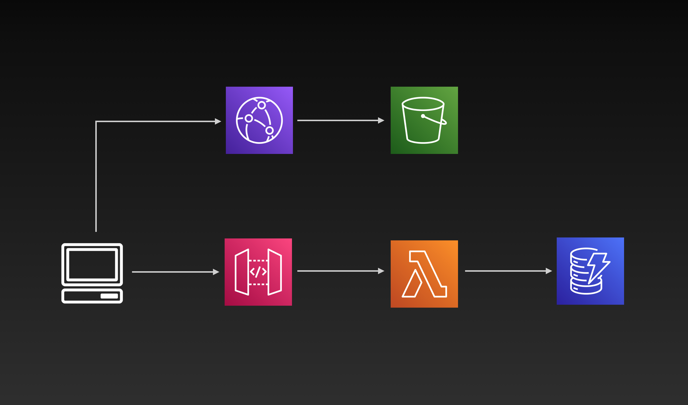
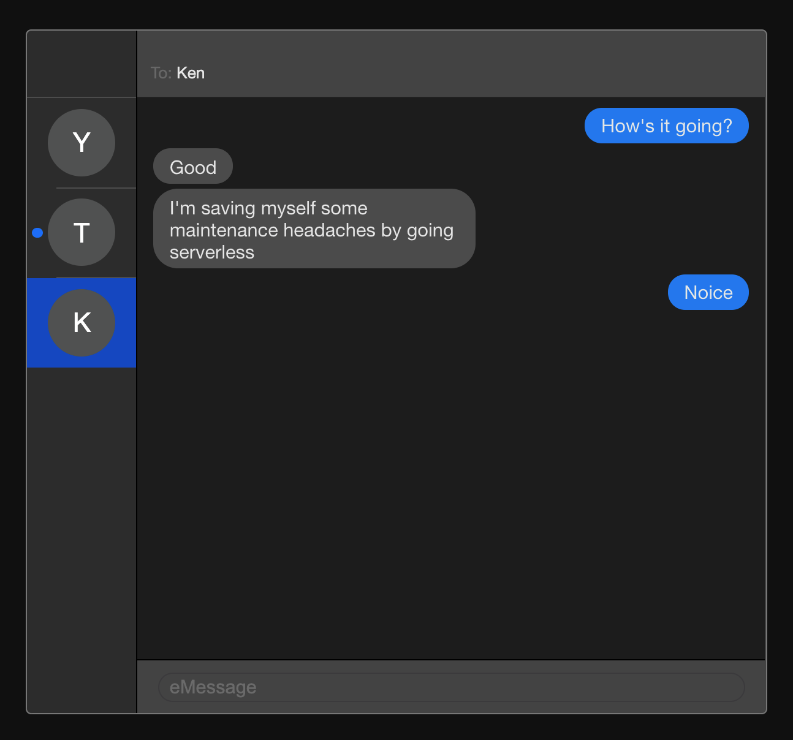

# sls-chat-app

### A real-time serverless chat application with Go and Vue 3. 

For the full write up see the Medium blog post.
- [Part 1]()

## Architecture

A serverless frontend deployment with S3 behind CloudFront, 
and a serverless backend with API Gateway, Lambda and DynamoDB. 

## UI

A minimal Vue 3 frontend with some custom CSS for 
highly-original UI design. 

